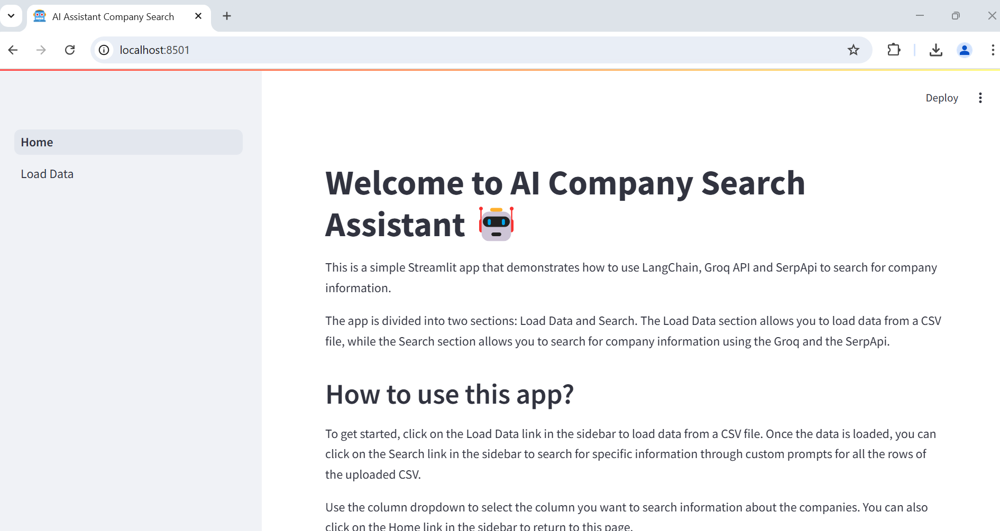

# AI Agent Company Search Assistant
The AI Agent Company Search Assistant helps you to search for specific information on multiple entities in a faster and efficient way. By harnessing the power of advanced artificial intelligence through LangChain and LLM, this application allows users to upload a CSV file containing a list of entities to perform a search. Through a chat bot interface, you can then execute natural language search using tailored prompts.

## Key Features
- Automated Entity Search: Simply upload a CSV file with your desired entities, and the AI Assistant Bot will handle the rest, delivering detailed search results based on your prompts.
- Integration with Advanced LLMs: By connecting to powerful LLMs like mixtral-8x7b-32768, the bot provides accurate and contextually relevant information.
- Enhanced Search Functionality: Utilizing the Serp API, the bot ensures that all search queries are executed efficiently, retrieving the most relevant data available.
- User-Friendly Interface: Built with Streamlit, the dashboard is designed to be intuitive and easy to navigate.

Watch the video <a href="https://www.loom.com/share/16565766f82544d9a62747d2eb257dc7?sid=dd4e946d-09a4-45d4-bfcb-fe36e82b449e" target="_blank">here</a>

## Design
This application leverages Langchain to seamlessly integrate Large Language Models (LLMs) and search tools, creating a robust and efficient search mechanism. The bot connects to the mixtral-8x7b-32768 LLM through Groq.

Although during testing, I primarily utilized the mixtral LLM due as it was able to understand the context, search & respond better, users have the flexibility to employ any other compatible LLMs based on their specific needs or preferences.

The search capabilities of the AI Assistant Bot are powered by the Serp API, that enhances the bot’s ability to retrieve precise and relevant search results.

The user interface of the AI Assistant Bot is built using Streamlit, a popular framework that allows for the creation of interactive and visually appealing dashboards. This ensures that users have an intuitive and seamless experience while interacting with the bot.


## Pre-requisites
You need two keys,
1. Groq API key. Create an API key at [Groq](https://console.groq.com/login)
1. SERP API Key. Create your SERP API key at [SerpAPI]([https://serpapi.com/])

## Configuration
In the config.json,
1. Add your Groq & Serp API key
1. Based on your plan, update the rate limits for Groq and Serp API calls to ensure that the rate limits will be adhered to

## Setup Virtual environment and install the packages
1. Navigate to the project directory. Create a virtual environment
```
python -m venv .venv
```
1. Activate your virtual environment
```
.\.venv\scripts\activate
```
1. Install the packages using pip
```
pip install -r requirements.txt
```

## Running the application
1. Navigate to the src folder
```
cd src
```
1. Run the application
```
streamlit run main.py
```
1. Browse to the Load Data page, upload your CSV or use your public Google Sheet. For example, you can upload a list of companies.
1. Once the data is loaded and you have selected one of the columns of interest, the Search navigation link will appear. For ex, the selected column will be the entity name column, i.e., CompanyName.
1. You can now enter your prompt to fetch the information for the entities under the selected column. For fetching information, if you have a company database, you can frame your prompt like 'What is the revenue of {CompanyName} for the quarter ending Sep 2024?'
1. The {CompanyName} will now be replaced with each company name and the results are displayed on the chat window
1. Due to throttling limits, the search pauses for few seconds before running a new query.

### Screen shots



## Future plans
1. The search results can be written back to the google sheets for the respective entity
1. Give an option to connect to private google sheets for enhanced security purpose
1. Integrate with other tools for more sophisticated search
1. General UI improvements